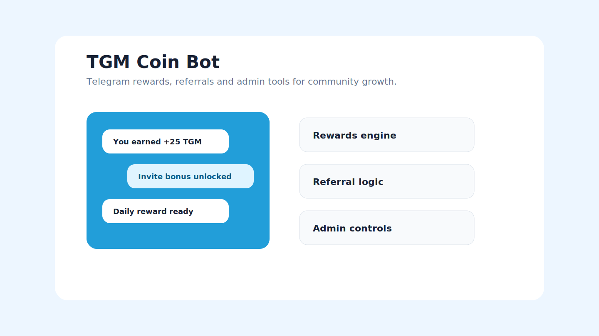

# TGM Coin Bot



A Telegram bot for community rewards, referrals, balances and admin controls.

## What It Does

The bot rewards useful chat activity, tracks coins and referrals, and gives admins a simple way to manage community mechanics without editing the database by hand.

## Public Links

- GitHub: https://github.com/KaimiEwl/tgm-coin-bot
- Portfolio card: https://kaimiewl.github.io/#work
- Architecture notes: `docs/architecture.md`

## Features

- Random coin rewards with cooldowns
- Referral and super-prize mechanics
- Anti-abuse state and owner controls
- Admin UI for users, chats and broadcasts
- Roadmap notes for mini-app and monetization experiments

## Stack

Python, python-telegram-bot, Flask, SQLite, Pillow.

## Run Locally

```bash
python -m venv .venv
. .venv/Scripts/activate
pip install -r requirements.txt
copy .env.example .env
python bot.py
```

## Check

```bash
python -m py_compile bot.py admin_ui.py storage.py
```

## Status

Demo export. Bot tokens, local database, private logs and runtime files are excluded.
